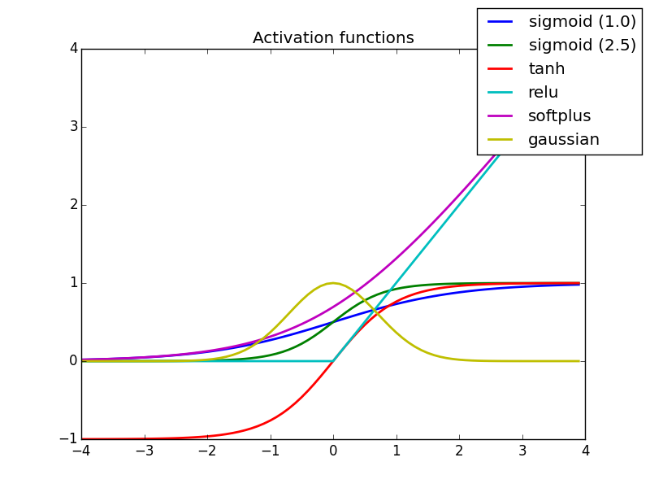
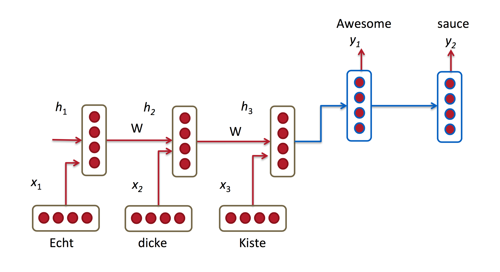
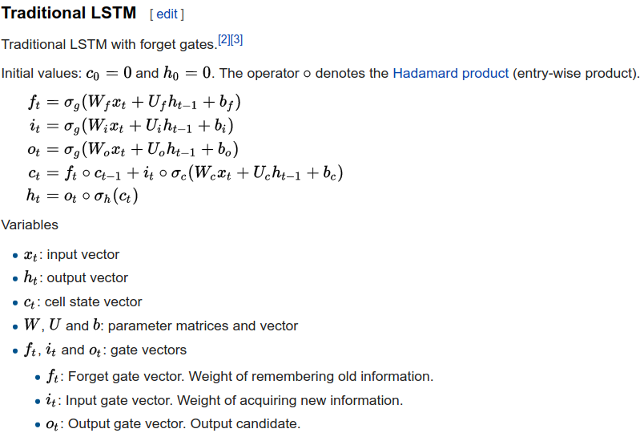
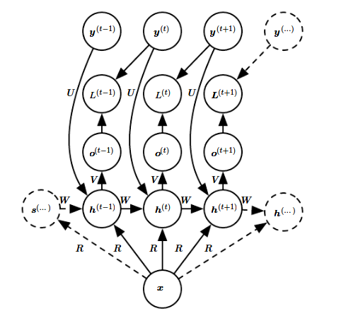

```{r setup, echo=F}
#knitr::opts_knit$set(root.dir = '/home/walling/dev/git/TACC_Deep_Learning_Reading/Weekly_Notes/')
```
<div style="line-height: 2em;">

## Outline

* RNN vs Feedforward Networks

* Example Applications

* Back Propogation Through Time

* Long-Short Term Memory

* Real Code
    + TACC Tickets Language Model w/ torch-rnn


## RNNs

* Typical Feedforward NN assume independence of the inputs

* Many problems naturally depend on the particular order/sequence of the input (gene analysis, NLP)
    + Fill in the blank: "When I lived in France I learned to speak ____."

* RNNs provide a way of use information about $X_{t-i}...X_{t_0}$ for inferrering on $X_t$

* Weights shared between each step (iteration), i.e. fewer parameters to estimate


## RNN Diagram


$$ s_t = tanh(U*x_t + W*s_{t-1}) $$

$$ o_t = softmax(V*s_t) $$


## tanh vs softmax

```
Generally, the recommendation is for tanh on the intermediate layers for +/- balance, and suit the output layer to the task (boolean/dichotomous class decision with threshold, logistic or competitive outputs (e.g. softmax, a self-normalizing multiclass generalization of logistic); regression tasks can even be linear
```



[Tutorial](https://medium.com/@karpathy/yes-you-should-understand-backprop-e2f06eab496b)


## Example Applications of RNN

* Building language models, i.e. auto sentence generation (auto correction)

* Machine Translation (English in/Spanish out)



* Auto image captioning


* Speech Recognition (input sequence acoustic signals)

* [Autogenerating Music](http://www.eecs.qmul.ac.uk/~sturm/research/RNNIrishTrad/index.html)


## Language Models


[Source](http://karpathy.github.io/2015/05/21/rnn-effectiveness/)

## Back Propogation Through Time (BPTT)

Loss function = cross-entropy
$$
\begin{aligned}  E_t(y_t, \hat{y}_t) &= - y_{t} \log \hat{y}_{t} \\  E(y, \hat{y}) &=\sum\limits_{t} E_t(y_t,\hat{y}_t) \\  & = -\sum\limits_{t} y_{t} \log \hat{y}_{t}  \end{aligned}  
$$

## Cross Entropy

```
When we develop a probabilistic model over mutually exclusive classes, we need a way to measure the difference between predicted probabilities  ŷ y^  and ground-truth probabilities  yy , and during training we try to tune parameters so that this difference is minimized.
In this post we saw that cross entropy is a reasonable choice.
From one perspective, minimizing cross entropy lets us find a  ŷ y^  that requires as few extra bits as possible when we try to encode symbols from  yy  using  ŷ y^ .
```

[Source: Intro to Cross Entropy](https://rdipietro.github.io/friendly-intro-to-cross-entropy-loss/)

## Cross Entropy Example

Model 1

```
computed       | targets              | correct?
-----------------------------------------------
0.3  0.3  0.4  | 0  0  1 (democrat)   | yes
0.3  0.4  0.3  | 0  1  0 (republican) | yes
0.1  0.2  0.7  | 1  0  0 (other)      | no
```

Model 2

```
computed       | targets              | correct?
-----------------------------------------------
0.1  0.2  0.7  | 0  0  1 (democrat)   | yes
0.1  0.7  0.2  | 0  1  0 (republican) | yes
0.3  0.4  0.3  | 1  0  0 (other)      | no
```

Classification Errors are equal, but cross-entropy gives..

Model 1

```
-(ln(0.4) + ln(0.4) + ln(0.1)) / 3 = 1.38
```

Model 2

```
-(ln(0.7) + ln(0.7) + ln(0.3)) / 3 = 0.64
```

[Source](https://jamesmccaffrey.wordpress.com/2013/11/05/why-you-should-use-cross-entropy-error-instead-of-classification-error-or-mean-squared-error-for-neural-network-classifier-training/)

## Back Propogation Through Time (BPTT)


$$
\frac{\partial E}{\partial W} = \sum\limits_{t} \frac{\partial E_t}{\partial W}
$$

[BPTT Tutorial](http://www.wildml.com/2015/10/recurrent-neural-networks-tutorial-part-3-backpropagation-through-time-and-vanishing-gradients/)


## BBPT - Chain Rule

$$
\begin{aligned}  \frac{\partial E_3}{\partial W} &= \sum\limits_{k=0}^{3} \frac{\partial E_3}{\partial \hat{y}_3}\frac{\partial\hat{y}_3}{\partial s_3}\frac{\partial s_3}{\partial s_k}\frac{\partial s_k}{\partial W}\\  
\end{aligned}  
$$


Differs from FFN as FFN don't share parameters and no need to sum up gradients at each time step.


## Vanishing Gradient
 
Derivative of tanh function is between 0 and 1
 


[Tutorial](http://www.wildml.com/2015/10/recurrent-neural-networks-tutorial-part-3-backpropagation-through-time-and-vanishing-gradients/)

* Note: Also can suffer from exploding gradient, though not as clear how/why.  Common to use gradient clipping to mitigate.

## Long-Short Term Memory (LSTM)

* Most common method for enabling reuse of information from distant past
* 'Cell State' containing past information
* 'Forget Gate' for controll how much of Cell State to forget at step t
* 'Input Gate' to control how much to update Cell State with new input at t
* Use new Cell State for output and as next step's 'Hidden State'





## LSTM - Forget Gate


## LSTM - Input Gate


## LSTM - Update Cell Memory


## LSTM - Output


# Variations of Simple RNN

* Teacher Forcing - use true output as input to next step

* Bi-directional - add 2nd layer going other direction.
    + Ex: Predict missing word in sentence


* Image Captioning




## TACC Tickets Language Model

* Based on [The Unreasonable Effectiveness of Recurrent Neural Networks](http://karpathy.github.io/2015/05/21/rnn-effectiveness/)
* Using Torch version of char-rnn [torch-rnn](https://github.com/jcjohnson/torch-rnn)
* Utilized Chameleon w/ P100 GPU + nvidia-docker

[Min Char RNN Code](https://gist.github.com/karpathy/d4dee566867f8291f086)


## TACC Tickets Data - Example Input

```
 On Thu Jun 22 15:41:44 2017, portal wrote:
  [Opened by] tg802251
  [Category] Login/Authentication Issue
  [Resource] Stampede2
 
  Hello,
 
  I use MFA on Stampede1 without problem.  However, I cannot log
  into
  Stampede2 using the same mechanism.  Here's an example:
 
  <blockquote
  [03:38 PM Thu Jun 22]  ssh tg802251@stampede2.tacc.utexas.edu
  Warning: Permanently added the ECDSA host key for IP address
  '129.114.63.41' to the list of known hosts.
  To access the system:
 
  1) If not using ssh-keys, please enter your TACC password at the
  password prompt
  2) At the TACC Token prompt, enter your 6-digit code followed by
  <return.
 
  Password: [Input TACC Token]
  Password: [Control-C]
  </blockquote
 
 
 
 
 
  --
  Daniel J. Bodony
  Blue Waters Associate Professor
  Donald Biggar Willett Faculty Scholar
  Department of Aerospace Engineering
  Affiliate Professor of Mechanical Science & Engineering
  University of Illinois at Urbana-Champaign
```

## TACC Tickets Data - Cleaning & Preprocess

* Dump of plaintext attchements from MySQL snapshot

* Remove all non-alphanumeric, puntuation, newline or space/tab characters (ex. ^M, ^A, weird stuff)

* Spacing and line breaks preserved as much as possible.

* torch-rnn Preprocess
    + Python script to convert to hdf5 and json
    + 532M characters (training)
    + 97 unique characters (plain text after cleaning), originally 917


## torch-rnn Workflow - Train

```
root@c3d25bf0b8fd:~/torch-rnn# th train.lua -input_h5 ../my_data.h5 -input_json ../my_data.json -checkpoint_every 10000 -num_layers 3 -rnn_size 512 -batch_size 500 -init_from cv/checkpoint_5000.t7 -reset_iterations 0 > training.log &
Running with CUDA on GPU 0	
Initializing from 	cv/checkpoint_5000.t7	
Epoch 1.23 / 50, i = 5001 / 1064400, loss = 1.416587	
Epoch 1.23 / 50, i = 5002 / 1064400, loss = 0.955876
..
Epoch 18.61 / 50, i = 374800 / 1064400, loss = 0.394211	
Epoch 18.61 / 50, i = 374801 / 1064400, loss = 0.402007	
Epoch 18.61 / 50, i = 374802 / 1064400, loss = 0.414517	
Epoch 18.61 / 50, i = 374803 / 1064400, loss = 0.412197	
Epoch 18.61 / 50, i = 374804 / 1064400, loss = 0.416769
```


## torch-rnn Workflow - Sample

```
root@c3d25bf0b8fd:~/torch-rnn# th sample.lua -checkpoint cv/checkpoint_370000.t7 -length 1000 -sample 1 -temperature 0.3 -start_text "On Tues"
On Tuesday, August 13, 2015 at 3:19 PM, Victor Eijkhout via RT <
 help@consult.tacc.utexas.edu wrote:

 On Thu Jun 26 15:37:06 2014, portal wrote:

  Hi Todd,
 
  I have a quick question. I was able to successfully run the job with the
  same code. I have tried to run the job again and it shows a list
  of job submission scripts and the error message is shown as soon as
  I highly receive the error message shown in the log file:
 
  [cli_0]: aborting job:
  application called MPI_Abort(comm=0xC4000019, 9999) - process 1
  [cli_14]: aborting job:
  application called MPI_Abort(MPI_COMM_WORLD, 1) - process 0
  [c424-604.stampede.tacc.utexas.edu:mpispawn_0][readline] Unexpected
  End-Of-File on file descriptor 14. MPI process died?
  [c520-301.stampede.tacc.utexas.edu:mpispawn_22][read_size] Unexpected
  End-Of-File on file descriptor 21. MPI process died?
  [c505-303.stampede.tacc.utexas.edu:mpispawn_12][handle_mt_peer] Error
  while reading PMI socket. MPI process died?
```

## torch-rnn Workflow - Sample2

```
root@c3d25bf0b8fd:~/torch-rnn# th sample.lua -checkpoint cv/checkpoint_5000.t7 -length 1000 -sample 1 -temperature 0.3 -start_text "On Tues"
On Tuesday, August 05, 2014 at 9:07 PM, Antia Lamas-Linares via RT <
            help@consult.tacc.utexas.edu wrote:
                    
                          Hi Anita,
                           
                             I am able to log into the TACC User Portal. I am able to login to stampede. I am able to login to my
                              simulation
                               for
                              stampede
                               with
                              the
                               file
                               line
                               of
                               the
                               node.
                                I would like to know what the
                               directories
                               would
                               be
                               working.
                                I
                                was
```

## Compute Requirements

Example for char-rnn tinyshakespeare dataset

* Number of iterations (forward + backward pass) a function of training size, batch size and sequence length, *not* rnn_size or num_layers

* A 'chunk' is the portion of total training data seen in each iteration.

* Epoch = # of iterations it takes to see all 'chunks', i.e. all the data.

```{r}
########
# torch-rnn data/tinyshakespeare/input.txt (from char_rnn clone)
########

total_chars = 1115396
train_size = 892318
vocab_size = 66
seq_length = 100
batch_size = 50
max_epochs = 25

target_iterations = 4450

(chunk_size = batch_size * seq_length)

(iter_per_epoch = as.integer(train_size / chunk_size))

(total_iter = iter_per_epoch * max_epochs)
```


## Number of Parameters

* Number of parameters is a function of vocab_size, rnn_size, num_layers only.  

* vocab_size related to size of 'problem'

* rnn_size & num_layers related to 'capacity'


```{r}
vocab_size = 66-1
num_layers = 2
rnn_size = 32
hidden_bias = rnn_size
output_bias = vocab_size
input_bias = vocab_size
target_params_1layer = 5378
target_params_2layer = 7490

# n2+kn+nm
# dim(W) + dim(U) + dim(V)
num_params_1layer = (((rnn_size)^2)+(hidden_bias*2)) +
              ((vocab_size*rnn_size)+input_bias) +
              ((rnn_size*vocab_size)+output_bias)

num_params_1layer

num_params_multilayer = (2*((rnn_size^2)*num_layers)+((hidden_bias*2)*num_layers)-((rnn_size^2))) +
              ((vocab_size*rnn_size)+input_bias) +
              ((rnn_size*vocab_size)+output_bias)

num_params_multilayer
```

[Dimensions of RNN](https://datascience.stackexchange.com/questions/10589/number-of-parameters-in-an-rnn)

[Dimensions of LSTM](https://www.quora.com/In-LSTM-how-do-you-figure-out-what-size-the-weights-are-supposed-to-be)


## GPU vs CPU

CPU 

```
root@b3f730e7c719:~/torch-rnn# th train.lua -input_h5 my_data.h5 -input_json my_data.json -num_layers 3 -rnn_size 256 -speed_benchmark 1 -memory_benchmark 1 -gpu -1
Running in CPU mode	
Forward / Backward pass took 	8.9199640750885	
Epoch 1.00 / 50, i = 1 / 12196700, loss = 6.881405	
Forward / Backward pass took 	9.1388840675354	
Epoch 1.00 / 50, i = 2 / 12196700, loss = 6.584148	
Forward / Backward pass took 	9.1044819355011	
Epoch 1.00 / 50, i = 3 / 12196700, loss = 5.942210
```

GPU

```
root@b3f730e7c719:~/torch-rnn# th train.lua -input_h5 my_data.h5 -input_json my_data.json -num_layers 3 -rnn_size 256 -speed_benchmark 1         
Running with CUDA on GPU 0	
Forward / Backward pass took 	0.22079610824585	
Epoch 1.00 / 50, i = 1 / 12196700, loss = 6.879130	
Forward / Backward pass took 	0.046185970306396	
Epoch 1.00 / 50, i = 2 / 12196700, loss = 6.613835	
Forward / Backward pass took 	0.04596996307373	
```


## Resources

Helpful links

* [Unreasonable Effectiveness of RNNs](http://karpathy.github.io/2015/05/21/rnn-effectiveness/)

* [RNN Tutorial](http://www.wildml.com/2015/09/recurrent-neural-networks-tutorial-part-1-introduction-to-rnns/)

* [Understanding LSTMs](http://colah.github.io/posts/2015-08-Understanding-LSTMs/)

